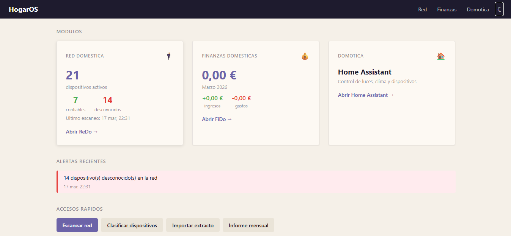

# HogarOS — Portal de Gestión Doméstica

Portal unificado para gestionar los servicios domésticos desde una única interfaz web, desplegado como contenedor Docker en servidor Proxmox.



---

## Idea y origen

Durante el desarrollo de **NetSentinel** (monitor de red local) y teniendo ya en funcionamiento **FiDo** (gestión de finanzas domésticas), surgió la idea de unificar ambas herramientas en un único portal accesible desde la red local.

En lugar de recordar distintas IPs y puertos (`192.168.31.131:3000` para la red, `192.168.31.131:8080` para finanzas), un portal central tipo _home dashboard_ concentra todo bajo una única URL y ofrece una visión global del estado del hogar.

---

## Arquitectura propuesta

```
hogar/
├── portal/              ← Nginx: reverse proxy + página de inicio
├── netsentinel/         ← Node.js (puerto interno 3000)
├── fido/                ← FastAPI / Python (puerto interno 8080)
└── docker-compose.yml   ← Un único compose para todo
```

### Flujo de peticiones

```
Usuario → http://192.168.31.131
              │
              ▼
           Nginx (80)
           ├── /          → Portal (inicio con widgets)
           ├── /red/      → NetSentinel
           └── /finanzas/ → FiDo
```

Cada aplicación mantiene su **independencia total** — pueden desplegarse y actualizarse por separado. El portal solo agrega sus APIs para mostrar resúmenes.

---

## Aplicaciones integradas

### 🔍 NetSentinel
- **Stack:** Node.js, nmap, JSON
- **Función:** Escaneo periódico de la red local (192.168.31.0/24), detección de dispositivos desconocidos, alertas por Telegram
- **Repositorio:** `acabellan1868-prog/netsentinel`
- **Datos que expone al portal:**
  - Nº de dispositivos activos
  - Nº de dispositivos confiables
  - Nº de dispositivos desconocidos (alertas)
  - Timestamp del último escaneo

### 💰 FiDo
- **Stack:** Python, FastAPI, SQLite
- **Función:** Gestión de finanzas domésticas — importación de extractos bancarios (CaixaBank, Revolut, Santander), categorización automática, panel de movimientos
- **Repositorio:** `acabellan1868-prog/FiDo`
- **Datos que expone al portal:**
  - Ingresos del mes actual
  - Gastos del mes actual
  - Balance
  - Últimos movimientos importados

---

## Página de inicio del portal

La página principal (`/`) muestra:

### 1. Tarjetas de módulos
Cada app tiene una tarjeta con sus métricas clave en tiempo real (obtenidas vía sus APIs). Un click en "Abrir →" lleva a la interfaz completa de la app.

### 2. Feed de alertas unificado
Un único listado cronológico con eventos de todas las apps:
- ⚠️ Dispositivos desconocidos detectados en la red
- 💰 Nuevos movimientos importados en FiDo
- ✅ Confirmaciones de escaneos sin incidencias

### 3. Accesos rápidos
Botones de acción frecuente sin necesidad de entrar a cada app:
- Lanzar escaneo de red
- Clasificar dispositivos pendientes
- Importar extracto bancario
- Ver informe mensual

---

## docker-compose.yml propuesto

```yaml
services:

  nginx:
    image: nginx:alpine
    container_name: hogar-portal
    ports:
      - "80:80"
    volumes:
      - ./nginx.conf:/etc/nginx/nginx.conf:ro
      - ./portal:/usr/share/nginx/html:ro
    depends_on:
      - netsentinel
      - fido
    restart: unless-stopped

  netsentinel:
    build: ./netsentinel
    container_name: netsentinel
    network_mode: host          # necesario para ARP scan
    cap_add:
      - NET_RAW
      - NET_ADMIN
    volumes:
      - ./netsentinel/config.json:/app/config.json:ro
      - ./netsentinel/devices.json:/app/devices.json
      - ./netsentinel/logs:/app/logs
    restart: unless-stopped
    environment:
      - TZ=Europe/Madrid

  fido:
    build: ./fido
    container_name: fido
    volumes:
      - /mnt/datos/fido:/app/data
    environment:
      - TZ=Europe/Madrid
      - FIDO_DB_PATH=/app/data/fido.db
    restart: unless-stopped
```

> **Nota:** NetSentinel usa `network_mode: host` para poder hacer ARP scans en la LAN. En ese modo no puede estar bajo el mismo bridge de Docker que Nginx, por lo que se comunican a través de `localhost`.

---

## Estructura de repositorios

Hay dos enfoques posibles:

### Opción A — Monorepo
```
hogar-os/
├── portal/          ← HTML/CSS/JS del dashboard
├── netsentinel/     ← git submodule o copia
├── fido/            ← git submodule o copia
└── docker-compose.yml
```

### Opción B — Repos independientes + compose externo
Cada app en su propio repositorio, y un repo `hogar-os` solo con el `docker-compose.yml`, la config de Nginx y el portal HTML.

**Recomendación:** Opción B — más limpia, cada app se puede actualizar y versionar de forma independiente.

---

## Próximos pasos

- [ ] Crear repositorio `hogar-os` en GitHub
- [ ] Adaptar `docker-compose.yml` con los tres servicios
- [ ] Configurar Nginx como reverse proxy
- [ ] Construir portal HTML con widgets reales (consumiendo las APIs de cada app)
- [ ] Añadir endpoint `/api/resumen` en NetSentinel (ya tiene `/api/estado`)
- [ ] Añadir endpoint `/api/resumen` en FiDo (resumen del mes actual)
- [ ] Desplegar en Proxmox y verificar comunicación entre contenedores

---

## Ideas futuras de expansión

Una vez el portal esté operativo, se pueden añadir nuevos módulos fácilmente:

| Módulo | Función |
|---|---|
| 🏠 Domótica | Estado de dispositivos Meross/Aqara |
| 📦 Inventario | Lista de productos del hogar |
| 🌡️ Clima | Temperatura/humedad de sensores |
| 📅 Tareas | Lista de tareas domésticas compartidas |
| 🔋 Energía | Consumo eléctrico desde enchufes Meross |

---

## Tecnologías

| Capa | Tecnología |
|---|---|
| Servidor | Proxmox VE (192.168.31.131) |
| Contenedores | Docker + Compose |
| Reverse proxy | Nginx Alpine |
| Portal frontend | HTML + CSS + JS vanilla (sin frameworks) |
| NetSentinel | Node.js 20, nmap |
| FiDo | Python 3.12, FastAPI, SQLite |
